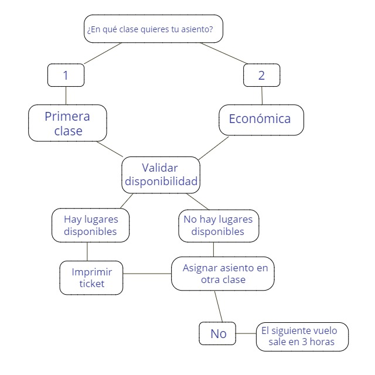

# RESERVAS DE PUESTOS AEROLINEA

* **Unidad:** _Interaccion con JavaScript
***

Una pequeña aerolínea acaba de comprar una computadora para su nuevo sistema de reservaciones automatizadas. Se te ha pedido que desarrolles el nuevo sistema. Escribirás una aplicación para asignar asientos en cada vuelo del único avión de la aerolínea (capacidad: 10 asientos).

***

## Consideraciones

* Encontrarás un archivo base `index.html` en el cual encontraras
  estructura del proyecto y el enlace al archivo de estilos (CSS).

* En la carpeta `css` tendrás un archivo base `main.css` donde       encontraras los estilos necesarios para el proyecto.

* Dentro de la carpeta `js` se encuentra la carpeta `app.js` donde
  encontrarás el script necesarias que completa el proyecto,en el encontraras los diferentes eventos para la interaccion.

  
     
## Objetivo

* Tu aplicación debe mostrar las siguientes alternativas:

Por favor escriba 1 para Primera Clase y Por favor escriba 2 para Económico.

* Si el usuario escribe 1, tu aplicación debe asignarle un asiento en la sección de primera clase (asientos 1 a 4). 

* Si el usuario escribe 2, tu aplicación debe asignarle un asiento en la sección económica (asientos 5 a 10).

* Tu aplicación deberá entonces imprimir un pase de abordar, indicando el número de asiento de la persona y si se encuentra en la sección de primera clase o clase económica.

* Tu aplicación nunca deberá asignar un asiento que ya haya sido asignado. Cuando esté llena la sección económica o primera clase, tu programa deberá preguntar a la persona si acepta ser colocada en la sección de primera clase (y viceversa).

* Si la persona acepta, haga la asignación de asiento apropiada.

Si no, debe imprimir el mensaje “El próximo vuelo sale en 3 horas”.

Este será el resultado
a lograr:

